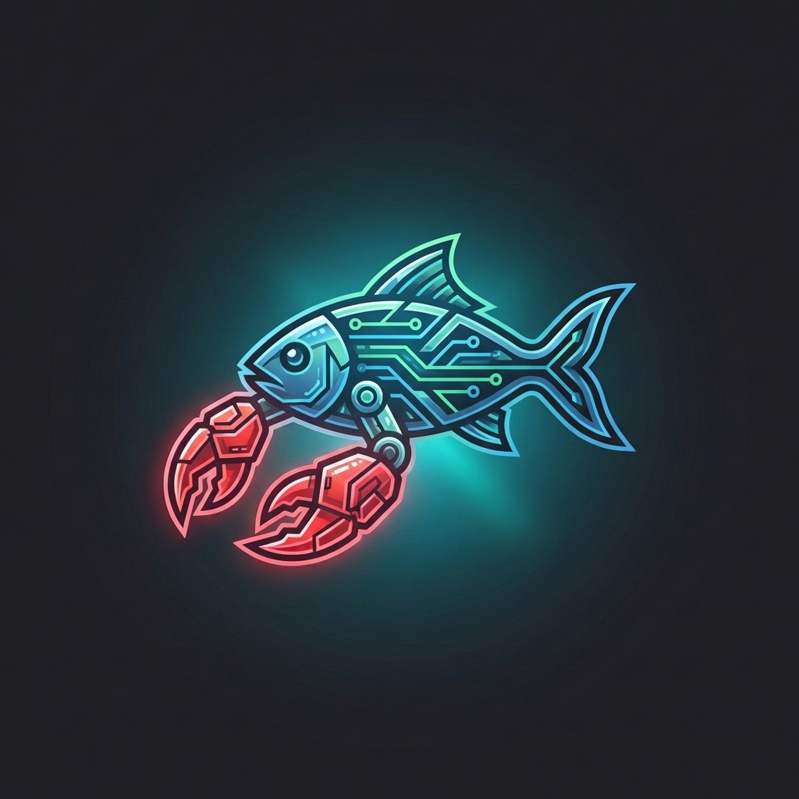

<p align="center">
  
</p>

<h1 align="center">MiroClaw</h1>

<p align="center">
  <strong>Local-first multi-agent simulation engine.</strong><br>
  Upload a document. Extract a knowledge graph. Spawn AI agents. Simulate what happens next.
</p>

<p align="center">
  <a href="#three-execution-modes">Three Modes</a> •
  <a href="#quick-start">Quick Start</a> •
  <a href="#how-it-works">How It Works</a> •
  <a href="#api-endpoints">API</a> •
  <a href="#credits">Credits</a>
</p>

<p align="center">
  
  
  
  
</p>

---

MiroClaw is a fork of [MiroFish](https://github.com/666ghj/MiroFish) that runs **entirely local** — no Zep Cloud, no mandatory API keys. Use your **Codex subscription**, an **API key**, or go fully offline with **Ollama**. Your choice.

## Three Execution Modes

| Mode | Backend | Use Case |
|------|---------|----------|
| **Ollama** (default) | Local Ollama + Neo4j | Fully offline, no API keys, total privacy |
| **API Key** | Any OpenAI-compatible API | Use OpenAI, Azure, DashScope, or any provider |
| **Codex** | OpenAI Codex via ChatGPT OAuth | Free-tier access through OpenClaw bridge |

## How It Works

1. **Graph Build** — Upload documents (PDF, MD, TXT). LLM generates an ontology and extracts entities + relationships into a Neo4j knowledge graph.
2. **Environment Setup** — AI generates agent personas from the graph, configures simulation parameters.
3. **Simulation** — Multi-agent simulation runs with dynamic memory updates and emergent behavior (powered by OASIS/CAMEL-AI).
4. **Report** — ReportAgent analyzes simulation results and generates a prediction report.
5. **Interaction** — Chat with any simulated agent or discuss findings with ReportAgent.

## Quick Start

### Prerequisites

- **Docker + Docker Compose** (recommended) or:
  - Python 3.11+
  - Node.js 18+
  - Neo4j 5.x Community Edition
  - Ollama (for ollama mode)

### Option A: Docker Compose (Recommended)

```bash
# Clone the repo
git clone https://github.com/justinfinnn/miroclaw.git
cd miroclaw

# Configure
cp .env.example .env
# Edit .env if needed (defaults work for Ollama mode)

# Start everything
docker compose up -d

# Pull required Ollama models (first time only)
docker exec miroclaw-ollama ollama pull qwen2.5:32b
docker exec miroclaw-ollama ollama pull nomic-embed-text

# Open http://localhost:3000
```

### Option B: Local Development

```bash
# Clone
git clone https://github.com/justinfinnn/miroclaw.git
cd miroclaw

# Configure
cp .env.example .env

# Start Neo4j (required for all modes)
# Install Neo4j CE 5.x: https://neo4j.com/download/

# Backend
cd backend
python -m venv .venv
source .venv/bin/activate
pip install -r requirements.txt
python run.py

# Frontend (new terminal)
cd frontend
npm install
npm run dev

# Open http://localhost:3000
```

## Mode Configuration

### Ollama Mode (Default — Fully Offline)

```env
MODELING_BACKEND=ollama
LLM_API_KEY=ollama
LLM_BASE_URL=http://localhost:11434/v1
LLM_MODEL_NAME=qwen2.5:32b
EMBEDDING_MODEL=nomic-embed-text
EMBEDDING_BASE_URL=http://localhost:11434
```

Pull models: `ollama pull qwen2.5:32b && ollama pull nomic-embed-text`

### API Key Mode

```env
MODELING_BACKEND=api_key
LLM_API_KEY=sk-your-api-key
LLM_BASE_URL=https://api.openai.com/v1
LLM_MODEL_NAME=gpt-4o-mini
```

Works with any OpenAI-compatible provider (Azure OpenAI, DashScope, Together, etc.)

### Codex Mode (via OpenClaw)

```env
MODELING_BACKEND=codex
CODEX_MODEL_NAME=gpt-5.4
# LLM_API_KEY is optional — OAuth token is used instead
```

Requires [OpenClaw](https://openclaw.com) with the `openai-codex` OAuth profile logged in. The token is auto-synced from OpenClaw's local credential store.

**Check status:** `GET /api/auth/codex/status`
**Manual sync:** `POST /api/auth/codex/sync`

## API Endpoints

### Core Workflow
- `POST /api/graph/ontology/generate` — Upload files + generate ontology
- `POST /api/graph/build` — Build knowledge graph
- `GET /api/graph/data/{graph_id}` — Get graph data
- `POST /api/simulation/create` — Create simulation
- `POST /api/simulation/{id}/start` — Run simulation
- `GET /api/report/{id}` — Get report

### Auth (Codex Mode)
- `GET /api/auth/codex/status` — OpenClaw bridge status
- `POST /api/auth/codex/sync` — Sync OAuth token from OpenClaw
- `POST /api/auth/openai/credential` — Store OAuth credential manually
- `GET /api/auth/openai/status` — Auth configuration status
- `GET /api/auth/openai/credentials` — List stored credentials

### Health
- `GET /health` — Service health check

## Architecture

```
┌─────────────────────────────────────────────────┐
│                   Frontend (Vue 3)               │
│            English UI • D3.js Graph Viz          │
└──────────────────────┬──────────────────────────┘
                       │ REST API
┌──────────────────────┴──────────────────────────┐
│                Backend (Flask)                    │
│                                                   │
│  ┌─────────────┐  ┌──────────┐  ┌────────────┐  │
│  │ ModelingBack│  │GraphStore│  │ Embedding  │  │
│  │ endSelector │  │Abstraction│  │ Service    │  │
│  └──────┬──────┘  └─────┬────┘  └─────┬──────┘  │
│         │               │              │          │
│    ┌────┴────┐     ┌────┴────┐    ┌────┴────┐   │
│    │ Ollama  │     │ Neo4j   │    │ Ollama  │   │
│    │ API Key │     │ Storage │    │ Embed   │   │
│    │ Codex   │     │         │    │         │   │
│    └─────────┘     └─────────┘    └─────────┘   │
└──────────────────────────────────────────────────┘
```

## Credits

This project combines work from two upstream repositories:

- **[666ghj/MiroFish](https://github.com/666ghj/MiroFish)** — Original MiroFish project (upstream)
- **[nikmcfly/MiroFish-Offline](https://github.com/nikmcfly/MiroFish-Offline)** — English UI, Ollama support, GraphStorage abstraction, Docker Compose, EmbeddingService, NER extractor (upstream)

### What came from where

**From MiroFish-Offline (upstream base):**
- Complete English frontend (1000+ translated strings)
- GraphStorage abstraction + Neo4jStorage implementation
- EmbeddingService (Ollama local embeddings)
- Ollama LLM support (num_ctx handling, is_ollama detection)
- NER/RE extractor via local LLM
- SearchService (hybrid vector + keyword)
- Docker Compose setup
- All simulation/report/interaction workflows

**From our fork (justinfinnn/miroclaw):**
- CodexClient (ChatGPT backend SSE protocol)
- OpenClaw bridge (auto-sync OAuth tokens)
- ModelingBackendSelector (three-mode routing)
- LLM credential store (file-backed OAuth token management)
- OAuth state store (PKCE machinery)
- Auth API routes (status, login, callback, credential CRUD, codex sync)
- GraphitiCodexLLMClient (Graphiti ↔ Codex adapter with rate limiting)
- Dual-auth LLMClient (api_key + OAuth modes)

**New in this repo:**
- Three-mode architecture (ollama + api_key + codex)
- Combined configuration supporting all modes
- Duplicate prepare trigger fix (Process.vue)
- Unified README and .env.example

## License

[AGPL-3.0](LICENSE)

## Contributing

PRs welcome. Please:
1. Keep the three execution modes working
2. Don't commit secrets, API keys, or user data
3. Test with at least one mode before submitting
